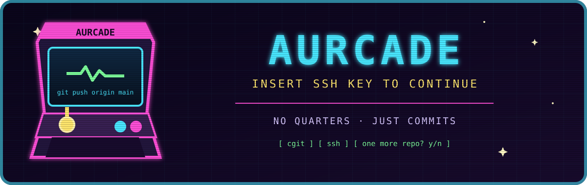
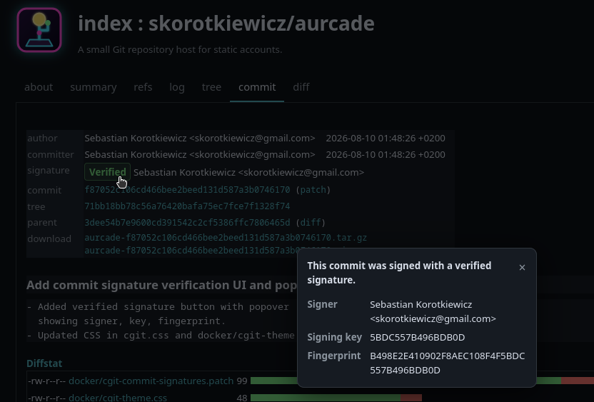

# AURcade

<!--<p align="center">
  
</p>-->

A tiny Git host with cgit over HTTP and authenticated pushes over SSH.

<p align="center">
  
</p>

- cgit provides the web interface and HTTP clones.
- SSH provides authenticated Git access.
- `config.toml` defines accounts, SSH keys, and repository paths.

## Run

Create a directory:

```sh
mkdir aurcade
cd aurcade
```

Create `config.toml`:

```toml
title = "AURcade"
domain = "example.com"
# Omit both to generate persistent self-signed files under ./tls.
# tls_certificate = "tls/fullchain.pem"
# tls_private_key = "tls/privkey.pem"
description = "My Git repositories"
clone_prefix = "http://localhost:8080 ssh://git@localhost:2222"
style = "cgit-theme.css"
logo = "aurcade-logo.svg"
favicon = "aurcade-favicon.svg"

[[accounts]]
name = "alice"
password_hash = "$argon2id$REPLACE_WITH_GENERATED_HASH"
ssh_keys = ["ssh-ed25519 REPLACE_WITH_YOUR_PUBLIC_KEY"]
gpg_keys = []
gpg_key_files = []
paths = ["alice/"]
```

Generate a ready-to-paste account block or only an Argon2id password hash:

```sh
docker compose run --rm --no-deps aurcade account-template alice
docker compose run --rm --no-deps aurcade hash-password
```

These commands print TOML without modifying `config.toml`.

```sh
docker run -d \
  --name aurcade \
  --restart unless-stopped \
  -p 8080:80 \
  -p 2222:22 \
  -v "$PWD/config.toml:/etc/aurcade/config.toml:ro" \
  -v "$PWD/keys:/etc/aurcade/keys:ro" \
  -v ./repositories:/var/lib/aurcade \
  -v ./ssh-host-keys:/etc/ssh/host_keys \
  ghcr.io/skorotkiewicz/aurcade:latest
```

With Compose:

```sh
docker compose up --build -d
```

Open <http://localhost:8080>. The optional commented Anubis service can protect HTTP while SSH remains direct. After account, domain, or service configuration changes, run `docker compose up -d --force-recreate`.

## Access

```toml
paths = ["example", "team/tools"] # An exact path grants access to one repository.
paths = ["alice/"]  # Namespace; creates repositories on first push.
```

Connect without a Git command to open the account's SSH lobby. Its 53-week activity calendar counts only commits on repository default branches with trusted SSH signatures belonging to that account:

```sh
ssh -p 2222 git@localhost
```

## Git

```sh
git clone ssh://git@localhost:2222/example.git

git remote add origin ssh://git@localhost:2222/alice/newrepo.git
git push -u origin main
```

Soft-delete an owned, non-shared repository by moving it into `.aurcade-trash/` inside the repository mount:

```sh
ssh -p 2222 git@localhost delete alice/old-repo --confirm alice/old-repo
```

## Chat

Compose runs Ergo IRC and Prosody XMPP with the same account names and `password_hash` values from `config.toml`. Configure service-specific options separately:

```toml
# irc.toml
network = "AURcade"
autojoin = ["#aurcade"]
```

```toml
# xmpp.toml
admins = ["alice"]
```

```toml
# soju.toml
admins = ["alice"]
```

Endpoints:

- Gamja: <http://localhost:8080/chat/>
- Converse.js XMPP: <http://localhost:8080/xmpp/>
- IRC TLS: `localhost:6697`
- Soju IRC TLS: `localhost:6698`
- XMPP clients: `alice@DOMAIN` on port `5222`
- XMPP over WebSocket: `/xmpp-websocket`
- XMPP federation: port `5269`

Gamja connects through Soju, so browser and native bouncer clients share one upstream session and persistent history in `soju_data`. Accounts and passwords remain authoritative in `config.toml`; administrators are listed in `soju.toml`.

When both global TLS paths are omitted, AURcade generates a persistent self-signed certificate in `./tls`. Configure both paths to use a CA-issued certificate instead:

```toml
tls_certificate = "tls/fullchain.pem"
tls_private_key = "tls/privkey.pem"
```

## Signed commits

SSH-signed commits are verified with the account's `ssh_keys`. For GPG signatures, add complete armored public keys:

```toml
gpg_keys = ['''
-----BEGIN PGP PUBLIC KEY BLOCK-----
...
-----END PGP PUBLIC KEY BLOCK-----
''']
```

Export one with `gpg --armor --export FINGERPRINT`. Alternatively, reference public-key files available inside the container:

```toml
gpg_key_files = ["keys/alice.asc"]
```

Key-file paths must begin with `keys/`, relative to `config.toml`. Invalid or missing GPG keys are ignored with a startup warning. Restart AURcade after changing keys.

## Metadata

Add `.aurcade` to a repository:

```console
A tiny repository with an unnecessarily dramatic README
```

Metadata refreshes after each push. Repositories shared by multiple accounts appear under `shared`.
